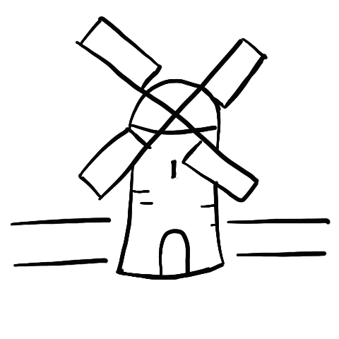

# Contributing

Rook is an open source project and like most blockchain networks is designed to be owned and led by the community. If you have ideas about how the game could improve, bugs you've experienced whilst playing, or questions you want answers to the best place is to open an issue on [Github](https://github.com/arcane-systems/rook/issue/new?).

